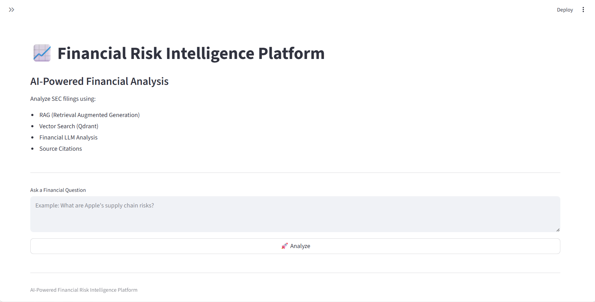
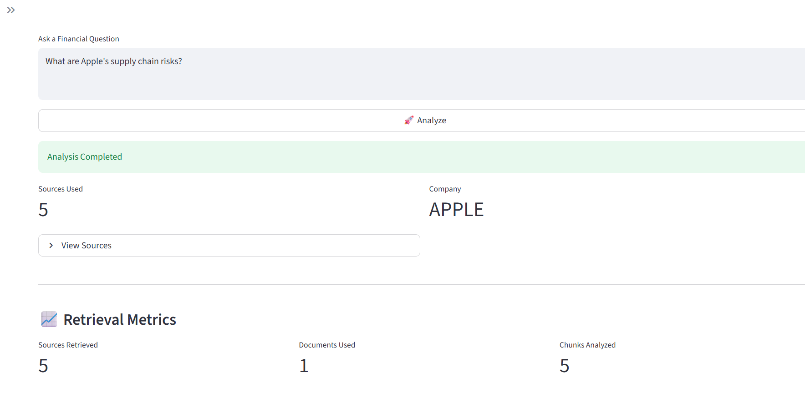
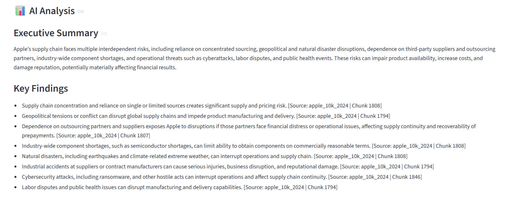
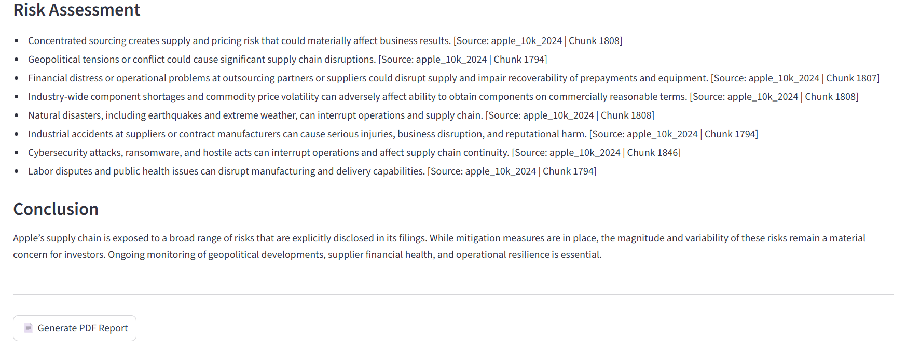
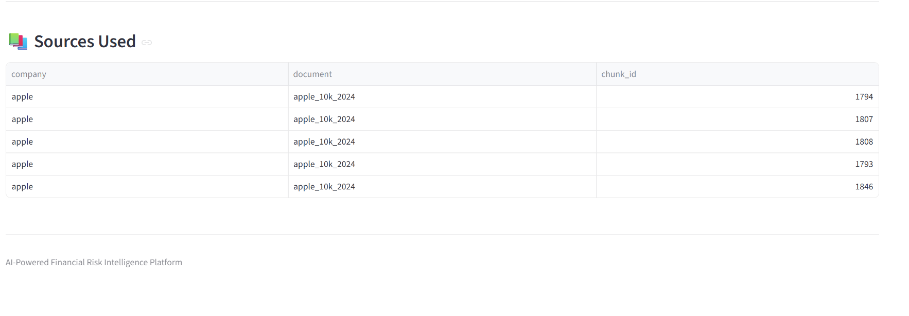
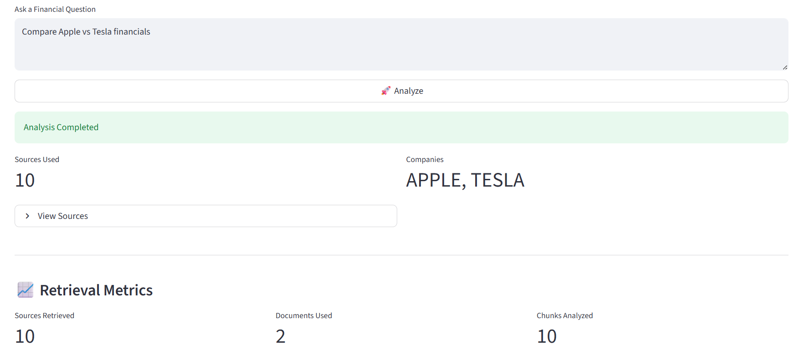
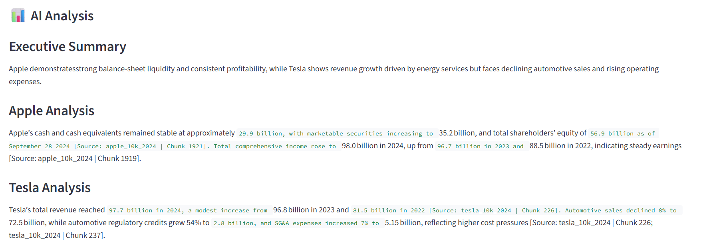
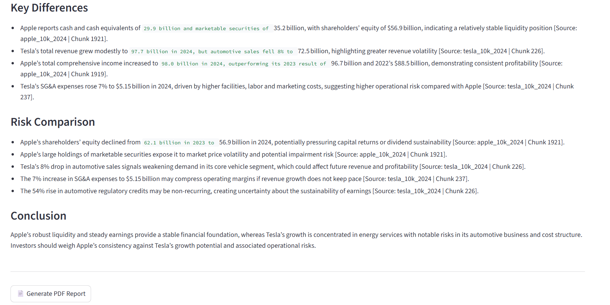
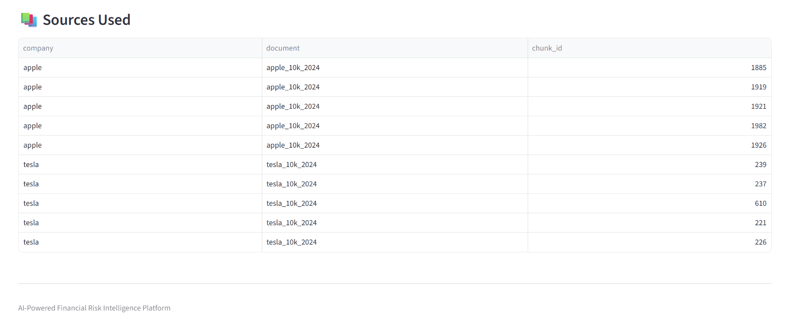

# Enterprise Financial Risk Intelligence Platform

## AI-Powered Financial Analysis using RAG, Hybrid Search, and Financial LLMs

---

# Overview

The Enterprise Financial Risk Intelligence Platform is an advanced Retrieval-Augmented Generation (RAG) system designed to analyze SEC filings and generate AI-powered financial intelligence.

Unlike traditional chatbot projects, this platform combines:

- Hybrid Search
- Vector Databases
- Cross-Encoder Reranking
- Financial LLM Analysis
- Source Attribution
- Automated PDF Reporting

to provide enterprise-grade financial risk insights.

The system enables analysts, researchers, investors, and business professionals to quickly identify risks, extract key findings, compare companies, and generate professional reports directly from financial documents.

---

# Business Problem

Financial analysts spend hundreds of hours reviewing:

- Annual Reports (10-K)
- Quarterly Reports (10-Q)
- Risk Disclosures
- Management Discussion & Analysis (MD&A)
- Regulatory Filings

Finding critical information manually is:

- time-consuming,
- expensive,
- difficult to scale.

This platform automates financial document analysis by retrieving the most relevant sections and generating structured risk intelligence reports powered by AI.

---

# Key Features

## Financial Risk Intelligence Engine

Generate:

- Executive Summaries
- Key Findings
- Risk Assessments
- Company Comparisons
- Financial Intelligence Reports

---

## Hybrid Retrieval System

Combines:

### Dense Retrieval

- BGE Embeddings
- Semantic Search
- Qdrant Vector Database

### Sparse Retrieval

- BM25 Search
- Keyword Matching
- Financial Term Retrieval

This improves recall and retrieval quality.

---

## Cross-Encoder Reranking

Uses:

### MS MARCO Cross Encoder

Benefits:

- higher retrieval precision,
- better context quality,
- fewer hallucinations,
- more relevant financial insights.

---

## Multi-Company Analysis

Compare companies such as:

- Apple
- Microsoft
- NVIDIA
- Tesla

Generate:

- Comparative Risk Profiles
- Strategic Differences
- Financial Intelligence Summaries

---

## Source Attribution

Every insight is grounded in retrieved SEC filing content.

Sources include:

- Document Name
- Chunk ID
- Company Name

This improves transparency and explainability.

---

## Interactive Dashboard

Built using Streamlit.

Features:

- Financial Question Answering
- Company Comparison Analysis
- Source Tracking
- Retrieval Metrics
- PDF Report Generation

---

## PDF Reporting

Generate professional reports containing:

- Executive Summary
- Key Findings
- Risk Assessment
- Sources Used

Suitable for:

- presentations,
- portfolio demonstrations,
- analyst reporting.

---

# System Architecture

```text
                        User Question
                              │
                              ▼
                    Company Detection
                              │
                              ▼
         ┌───────────────────────────────────┐
         │        Hybrid Retrieval           │
         │                                   │
         │   Vector Search (Qdrant)          │
         │               +                   │
         │        BM25 Search                │
         └───────────────────────────────────┘
                              │
                              ▼
                  Candidate Financial Chunks
                              │
                              ▼
                  Cross Encoder Reranker
                              │
                              ▼
                     Top Relevant Chunks
                              │
                              ▼
                    Financial LLM Analysis
                              │
                              ▼
                    Risk Intelligence Report
                              │
                              ▼
                     PDF Report Generation
```

---

# Retrieval Pipeline

```text
Question
   │
   ▼
Vector Search (Qdrant)
   +
BM25 Search
   │
   ▼
Candidate Chunks
   │
   ▼
Cross Encoder Reranking
   │
   ▼
Top Ranked Chunks
   │
   ▼
Financial LLM
   │
   ▼
Final Financial Analysis
```

---

# RAG Pipeline

## Step 1

User submits a financial question.

Example:

```text
What are Apple's supply chain risks?
```

---

## Step 2

Hybrid retrieval fetches relevant chunks from SEC filings.

Retrieval sources:

- Vector Search
- BM25 Search

---

## Step 3

Cross Encoder reranker scores all candidate chunks.

Most relevant chunks are selected.

---

## Step 4

Selected chunks are sent to the Financial LLM.

---

## Step 5

LLM generates:

- Executive Summary
- Key Findings
- Risk Assessment
- Conclusion

---

# Financial Intelligence Capabilities

The system can answer questions such as:

### Risk Analysis

```text
What are Apple's supply chain risks?
```

### AI Strategy

```text
How is Microsoft using artificial intelligence?
```

### Business Strategy

```text
What is NVIDIA's data center strategy?
```

### Company Comparison

```text
Compare Apple and Tesla supply chain risks.
```

### Competitive Intelligence

```text
Compare NVIDIA and Microsoft AI strategies.
```

---

# Dashboard Features

## AI Analysis Dashboard

Provides:

- Financial Question Answering
- Risk Intelligence Reports
- Multi-Company Comparisons

---

## Retrieval Metrics

Displays:

- Sources Retrieved
- Documents Used
- Chunks Analyzed

---

## Source Explorer

Users can inspect:

- Company
- Document
- Chunk ID

for every retrieved source.

---

## PDF Export

One-click generation of:

- Financial Reports
- Risk Assessment Reports
- Company Comparison Reports

---

# Dashboard Preview

## Main Dashboard



---

## Financial Analysis







---

## Company Comparison







---

# Example Output

## Executive Summary

Apple's supply chain faces multiple interrelated risks, including geopolitical instability, supplier concentration, trade restrictions, cybersecurity incidents, and natural disasters that could impact manufacturing and delivery.

---

## Key Findings

- Manufacturing is concentrated in a limited number of countries.
- Supply chain operations depend heavily on outsourcing partners.
- Cybersecurity incidents may disrupt logistics and operations.
- Trade restrictions can increase operational costs.

---

## Risk Assessment

- Geopolitical tensions may disrupt manufacturing.
- Natural disasters could impact production facilities.
- Supplier financial instability may affect component availability.
- Cyber incidents can interrupt supply chain operations.

---

# Technology Stack

| Category | Technology |
|-----------|------------|
| Programming Language | Python |
| Frontend | Streamlit |
| Vector Database | Qdrant |
| Embedding Model | BAAI BGE Small |
| Reranker | Cross Encoder |
| LLM Provider | OpenRouter |
| Retrieval | Hybrid Search |
| Sparse Search | BM25 |
| Data Processing | Pandas |
| PDF Reporting | ReportLab |

---

# Project Structure

```text
financial-risk-intelligence/
│   
├── assets/
│
├── src/
│   │
│   └── archive/
│   ├── embeddings/
│   ├── pipeline/
│   ├── rag/
│   ├── reporting/
│   ├── search/
│   ├── ui/
│   └── vector_db/
│
├── data/
│
├── reports/
│
│
├── requirements.txt
│
│
├── LICENSE
│
├── .env
│
├── .gitignore
│
└── README.md

```

---

# Performance Improvements

Implemented:

- Hybrid Search Retrieval
- Cross Encoder Reranking
- Context Filtering
- Source Attribution
- Company Detection
- Multi-Document Retrieval

Benefits:

- Higher retrieval precision
- Reduced hallucinations
- Better answer quality
- Improved explainability

---

# Production Engineering Features

This project demonstrates:

- Retrieval-Augmented Generation (RAG)
- Hybrid Search Architecture
- Vector Databases
- Semantic Search
- Cross Encoder Reranking
- Financial AI Applications
- Source Grounding
- Enterprise Reporting
- Interactive Dashboards

---

# Future Improvements

Potential enterprise extensions include:

## Multimodal Financial Analysis

- Earnings Call Audio Analysis
- Investor Presentation Analysis
- Financial Chart Understanding

---

## Real-Time SEC Monitoring

- Automatic SEC Filing Tracking
- Risk Alerts
- Company Monitoring

---

## Financial Knowledge Graph

- Company Relationship Mapping
- Risk Propagation Analysis

---

## Agentic Financial Research Assistant

- Autonomous Research Workflows
- Multi-Step Financial Analysis
- Investment Research Automation

---

# Why This Project Stands Out

This closely resembles modern AI systems used in:

- Investment Research
- Financial Intelligence
- Risk Management
- Enterprise Knowledge Systems
- Financial Advisory Platforms

---
